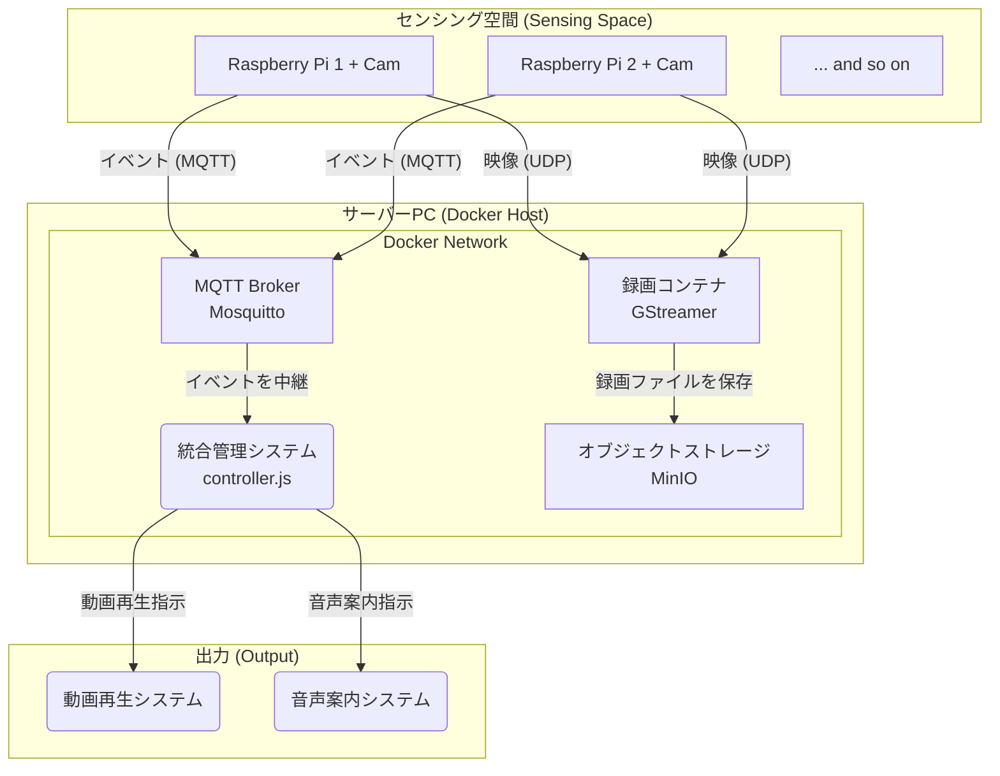

# リアルタイム行動解析・映像蓄積プラットフォーム (サーバー側)

## 1. 概要

### 1.1. プロジェクトの目的
本プロジェクトの目的は、特定の空間（実験室、オープンキャンパス会場など）に設置された複数台のカメラを用いて、**人物の行動をリアルタイムで解析し、その状況に応じたインタラクションを自動で実行する**ための、汎用性と拡張性を備えたプラットフォームを構築することにある。

具体的には、以下の2つの主要な機能を両立させます。

1.  **リアルタイム・イベント駆動:**
    空間内の「人の入室」「全員の着席」といった行動の変化を「イベント」として即座に検知し、その情報を中央の管理システムに通知します。管理システムは、このイベントをきっかけ（トリガー）として、動画の再生や音声案内といったアクションを自動で実行します。

2.  **データの永続化と分析基盤:**
    リアルタイムのイベント通知と並行して、全てのカメラ映像を常時サーバーにストリーミングし、映像データとして蓄積します。これにより、後から映像を見返しての行動分析や、将来的な機械学習モデルの訓練データとしての再利用が可能になります。

このシステムは、**GitHub**によるコード管理と**Docker**による環境構築の自動化を前提としており、どのマシンにでも簡単に展開（デプロイ）できる、高い移植性を実現します。

## 2. システムアーキテクチャ



### 2.1. 各コンポーネントの役割

* **センサーノード (Raspberry Pi):**
    * **責務:** 担当するカメラ映像のリアルタイム解析と、結果の送信に特化する「目」。
    * **言語:** Python
    * **機能:** 人物検出(YOLOv8)、姿勢推定(MediaPipe)を実行し、解析結果（状態・イベント）をMQTTで、映像をFFmpeg/GStreamerでそれぞれ送信する。
* **MQTTブローカー:**
    * **責務:** 全てのRaspberry Piからの状態・イベント通知を中継するメッセージングハブ。
    * **技術:** Mosquitto
* **統合管理システム (Controller):**
    * **責務:** MQTTで受信したイベントに基づき、システム全体の動作を決定し、各所へ指示を出す頭脳。
    * **言語:** **Node.js**
    * **機能:** イベントに応じた動画再生や音声案内のトリガー、複数カメラからの情報（人数など）の統合・判断を行う。
* **映像蓄積サーバー (Recorder + Storage):**
    * **責務:** Raspberry Piから送られてくる全カメラの映像ストリームを受信・録画し、恒久的なストレージに保存する。
    * **技術:** **Docker**, GStreamer, **MinIO**
* **出力システム (Player):**
    * **責務:** 統合管理システムからの指示に基づき、ユーザーへのフィードバック（動画・音声）を再生する。

### 2.2. データフローの要点
このシステムの鍵は、**「映像の流れ」**と**「情報の流れ」**を完全に分離している点です。
* **映像の流れ (UDP):** 大容量の映像データは、高速なUDPプロトコルで、センサーノードから録画コンテナへ一方的に送り続けられます。
* **情報の流れ (MQTT):** 「誰かが座った」といった軽量かつ重要なイベント情報は、信頼性の高いMQTTプロトコルで、ブローカーを介して正確に統合管理システムへ届けられます。

この分離により、システム全体の安定性とリアルタイム性を両立させています。

## 3. セットアップと実行

本サーバー環境はDockerによって完全にコンテナ化されているため、前提条件を満たしたどのマシンでも、以下の手順で簡単に再現・起動できます。

### 3.1. 前提条件
* Docker Desktop
* Git

### 3.2. 実行手順
1.  **リポジトリのクローン:**
    ```bash
    git clone [このリポジトリのURL]
    ```
2.  **ディレクトリの移動:**
    ```bash
    cd [リポジトリ名]
    ```
3.  **Dockerコンテナのビルドと起動:**
    ```bash
    docker compose up --build
    ```
    （バックグラウンドで起動する場合は `-d` オプションを追加）

4.  **動作確認:**
    * **MinIO管理画面:** `http://localhost:9002` にアクセス (ID/PW: `minioadmin`)
    * **MQTT Broker:** ポート `1883` で待機
    * **映像受信:** UDPポート `5000` で待機

## 4. ディレクトリ構造

```
.
├── docker-compose.yml  # Dockerアプリケーション全体の設計図
├── mosquitto/          # MQTTブローカー用の設定・データフォルダ
│   └── config/
│       └── mosquitto.conf
├── recorder/           # 録画コンテナの関連ファイル
│   ├── Dockerfile      # 録画コンテナの作り方を定義する設計図
│   └── recorder.sh     # 実際の録画とアップロード作業を行うスクリプト
└── README.md           # このファイル
```

## 5. 機能要件

* **FR-1: リアルタイム行動解析:** 各センサーノードは、人物の人数と姿勢（「SITTING」「STANDING」）をリアルタイムに推定すること。
* **FR-2: イベント検知:** 各センサーノードは、「入室」「着席完了」「退室」などの状態変化を「イベント」として検知できること。
* **FR-3: 状態・イベント通知:** 全ての通知は、定義された統一JSON形式でMQTTを介して送信されること。
* **FR-4: 映像データの永続化:** 全てのカメラからの映像ストリームを常時受信し、カメラIDごとに整理されたバケットに動画ファイルとして保存すること。
* **FR-5: イベント駆動のアクション実行:** 統合管理システムは、イベント通知に応じて動画再生や音声案内などのアクションを実行できること。
* **FR-6: 人数情報の統合:** 統合管理システムは、複数カメラからの人数情報が異なる場合、多数決方式で正式な人数を決定すること。

## 6. 非機能要件

* **NFR-1: パフォーマンス:** イベント検知からアクション実行までの遅延を最小限に抑えること。
* **NFR-2: 拡張性・汎用性:** センサーノードの増減や、検知イベント・アクションの種類を容易に変更・追加できる設計であること。
* **NFR-3: 開発・運用・管理の容易性:** **GitHub**によるコードのバージョン管理と、**Docker**による環境構築の自動化を行うこと。
* **NFR-4: 開発環境:** ノートパソコン1台で、システム全体の動作をシミュレートできること。

## 7. スコープ外
* 本プロジェクトのスコープは、上記プラットフォームの構築と、基本的なイベント検知・アクション実行の実現までとする。
* MinIOに蓄積された映像データを用いた、高度な機械学習や統計分析そのものは、本プロジェクトの範囲外（将来の展望）とする。
